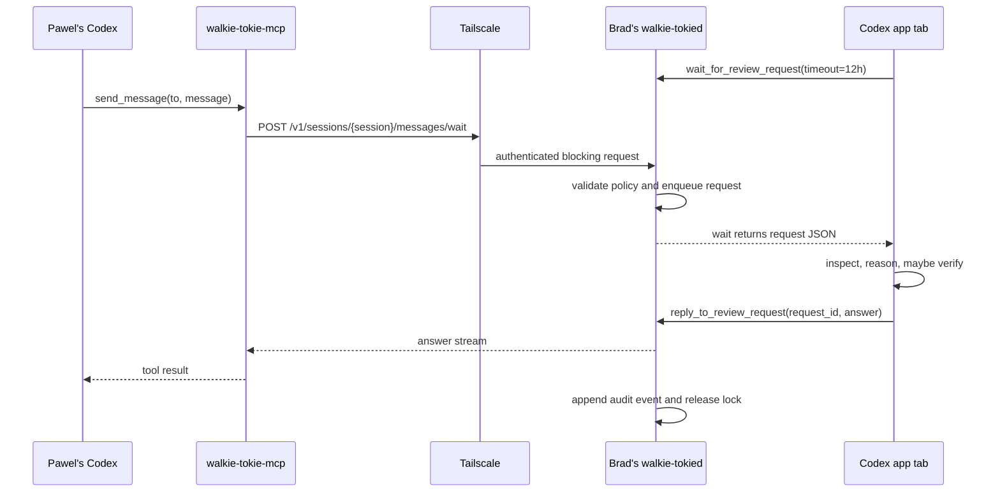
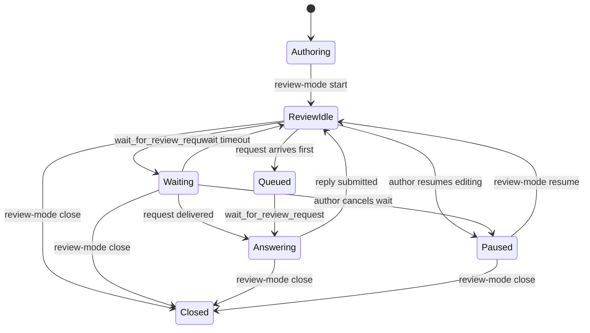

# Architecture

## Summary

Use a parked live Codex session as the review endpoint.

When the author is done working on a PR, they explicitly switch the session into
review mode. While review mode is active, remote reviewer agents can send
bounded questions to that session through an author-side relay.

The relay does not wake Codex from the outside. The visible author session calls
a blocking local tool, `wait_for_message`, and parks there. A reviewer agent
calls a blocking local tool, `send_message(to, message)`, and
parks there. The relay matches the two blocking calls.

MCP stays local to each agent. Tailscale carries a small relay protocol between
machines.

## Why This Shape

The workflow wants one durable thread, not a throwaway support bot. The author
should be able to come back after review, resume the same Codex session, and see
the review conversation in context.

The design still needs an explicit lifecycle. Remote agents should not be able
to inject messages into a session while the author is actively steering it. That
is what review mode provides: an exclusive lease that says "this session is now
idle and the current turn is intentionally waiting for reviewer questions".

## Components

### Author Relay

`walkie-tokied` runs on the author's machine.

Responsibilities:

- listen on a Tailscale-only address
- authenticate the peer machine and user
- map a PR endpoint to a Codex session
- enforce allowed reviewers and capabilities
- serialize access with a per-session queue and in-flight request lock
- deliver the next request to the author's blocking wait call
- stream the response back to the caller
- write audit events
- close or pause review mode

It should not expose arbitrary command execution. It should only expose named
review capabilities.

### Local MCP Server

`walkie-tokie-mcp` runs on the reviewer's machine.

Responsibilities:

- expose agent-friendly tools
- send messages to a host/session chosen at tool-call time
- send questions to the author relay
- stream answers back to the reviewer's agent
- present errors in human language

The same MCP server binary also runs on the author's machine and is attached to
the author's Codex session.

Responsibilities:

- expose `wait_for_message`
- expose `reply_to_review_request`
- expose `close_review_mode`
- keep the visible Codex turn blocked while waiting
- return the next queued request as structured JSON
- send the author's answer back to the relay

This is the app-visible integration point. It uses normal Codex tool execution
instead of external app control.

The expected author loop is:

```text
wait_for_message(session_name="big-lad-john", timeout=12h)
answer the returned question
reply_to_review_request(request_id, answer)
wait_for_message(session_name="big-lad-john", timeout=12h)
```

The reply and next wait can be combined later as a convenience tool, but keeping
them separate first makes lifecycle and audit behavior easier to reason about.

The MCP server is local glue. It is not the network security boundary. Each
agent gets local tools; the relay HTTP API is the cross-machine protocol.

### Audit Store

Every remote request gets a durable audit event.

The minimum useful fields are:

- request id
- PR identity
- session id or thread name
- caller identity
- requested capability
- timestamps
- prompt hash
- response status
- command/check summary if `verify` was used

The full prompt and answer should also be appended to the Codex session. The
audit log is for operations and accountability; the Codex transcript is for
human understanding.

## Data Flow



## Session State



Remote requests are accepted only while review mode is active. If the author
agent is not currently waiting because it is answering another request, the
relay may queue a small number of requests. The reviewer-side MCP call remains
blocked until the request is answered, rejected, cancelled, or times out.

## Capability Model

Capabilities should be explicit and narrow:

- `explain`: answer from current session context and supplied PR metadata
- `inspect`: may read repository files and diffs
- `verify`: may run allowlisted commands such as tests or lint
- `propose`: may suggest a patch but not apply it
- `write`: reserved for a later design; requires human approval

The initial implementation should support `explain`, `inspect`, and maybe
`verify`. That covers the review use case without giving the reviewer write
access to the author's workspace.

## Earlier App-Control Probe

An earlier design tried to wake the open Codex app tab from an external relay.
That would have required a second local client to steer the Codex Desktop
app-server.

Probe result on 2026-05-13: enabling `remote_control` and restarting Codex
Desktop did trigger the native remote-control path. The app-server attempted to
create a remote-control enrollment with
`wss://chatgpt.com/backend-api/wham/remote/control/server`, using the client
name `Codex Desktop`. Enrollment failed with HTTP 404 and no row was written to
`remote_control_enrollments`.

That suggests native remote control is a cloud-mediated control channel, not a
local listener suitable for direct Tailscale use. The blocking-tool design avoids
depending on this surface.

## Session File Probe

On 2026-05-13, we tested direct session JSONL mutation on an inactive Codex
thread. The session SQLite database only stored thread metadata; the transcript
itself lived in the rollout JSONL file.

Appending a synthetic assistant message to the inactive thread's JSONL caused
`codex exec resume <thread-id>` to load that fake message into model context.
The model was able to report a sentinel token from the injected message. The
test file was restored afterwards.

This proves JSONL mutation can affect future resumes. It does not prove that an
already-open Codex Desktop tab will live-update from disk, and it is too risky
as the primary review transport. A live app-server may be appending to the same
file, and injected transcript items could corrupt ordering, auditability, or UI
state. Use this only as a diagnostic fact, not as the design.

## Open Questions

- Should review mode pause automatically when the author sends any non-review
  instruction to the same session?
- Is a thread name stable enough as the public session identifier, or should the
  relay map friendly names to Codex UUIDs?
- What is the maximum safe duration for an MCP tool call in Codex Desktop before
  clients, transports, or model turn semantics become awkward?
- Should the relay use HTTP streaming first, WebSocket, or gRPC bidi streaming
  for blocking `ask`/`wait` calls?
- How should reviewer identity map from Tailscale machine/user identity into
  stable policy names?
